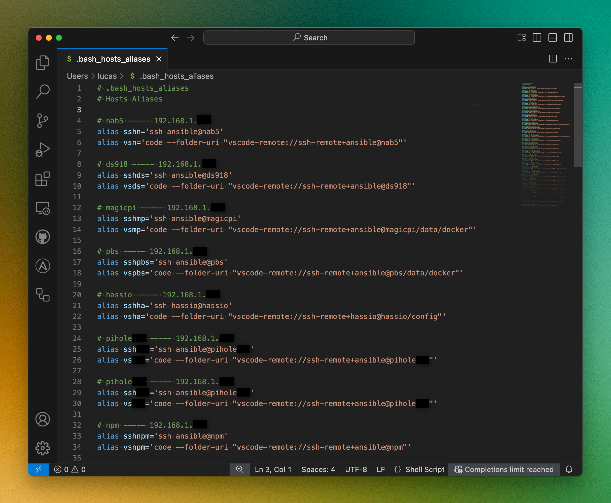

# Ansible Role: Hosts Aliases

This Ansible role creates SSH and VSCode Remote SSH aliases for hosts in your inventory, making it easier to connect to remote servers. It adds these aliases to a user's bash profile on a management host.

## Features

- Add all host to an bash_hosts_aliases
- Alias of ssh access to the host
- Alias of editor access to the host (optional)

## Screenshot


## Requirements

- Ansible 2.1 or higher
- A management host where the aliases will be created (typically your local machine)
- Remote hosts that you want to connect to via SSH and VSCode Remote SSH

## Role Variables

Required variables:

Host information lists - these should be populated from inventory or vars

| Variable | Type | Description | Default |
|----------|------|-------------|---------|
|dev_hostnames|area|List of hostnames to create aliases for||
|dev_ips|area|List of IPs corresponding to hostnames||
|dev_alias|area|List of short aliases for each host||
|dev_vspaths|area|List of paths to open in VSCode for each host||
|dev_ansible_ssh_users|area|List of SSH users for each host||

Management host information

| Variable | Type | Description | Default |
|----------|------|-------------|---------|
|user|str|Username on the management host||
|host|str|Hostname of the management host||
|home|str|Home directory path on the management host||

Optional variables with defaults:

| Variable | Type | Description | Default |
|----------|------|-------------|---------|
|bash|str|Bash profile file to modify|".bashrc"|
|bash_hosts_aliases|str|File to store the aliases|".bash_hosts_aliases"|
|editor_path|str|Path to the VSCode executable|"code"|
|create_editor_aliases|bool|Whether to create VSCode aliases|true|
|comment|str|Comment for the aliases file|"Hosts Aliases"|

## Dependencies

None

## Example Playbook

```yaml
- name: Create host aliases on management host
  hosts: localhost
  gather_facts: false
  vars:
    management_user: "you"
    management_host: "your-mac"
    management_home: "/Users/you/"
  pre_tasks:
    - name: Set aliases from inventory
      set_fact:
        dev_alias: "{{ dev_alias + [hostvars[item].alias | default(item)] }}"
      loop: "{{ dev_hostnames }}"
      
    - name: Set vspaths from inventory
      set_fact:
        dev_vspaths: "{{ dev_vspaths + [hostvars[item].vspath | default('/home/' + hostvars[item].ansible_user + '/')] }}"
      loop: "{{ dev_hostnames }}"
      
    - name: Set SSH users from inventory
      set_fact:
        dev_ansible_ssh_users: "{{ dev_ansible_ssh_users + [hostvars[item].ansible_user | default('ansible')] }}"
      loop: "{{ dev_hostnames }}"
  tasks:
    - name: Include hosts aliases role
      include_role:
        name: ansible-role-hosts-aliases
      vars:
        user: "{{ management_user }}"
        host: "{{ management_host }}"
        home: "{{ management_home }}"
        bash: ".bashrc"
        bash_hosts_aliases: ".bash_hosts_aliases"
        create_editor_aliases: true
```

## Inventory Example

Here's an example inventory file format that works with this role:

```ini
[all]
ansible     ansible_host="192.168.1.10"   alias="a"     vspath="/home/ansible/ansible"
docker      ansible_host="192.168.1.11"   alias="d"     vspath="/data/docker"
homepage    ansible_host="192.168.1.12"   alias="hp"    vspath="/opt/homepage/config"

[all:vars]
ansible_user="ansible"
```

## Testing

The role includes a test playbook and inventory that can be used to verify functionality. To run the tests:

```bash
cd ansible-role-hosts-aliases
ansible-playbook -i tests/inventory.ini tests/test.yml
```

The test creates bash aliases in a temporary directory to avoid modifying your actual bash profile during testing.

```bash
cat /tmp/test_bash_hosts_aliases
```

After running the role, you'll have aliases like:

```bash
# .bashrc_hosts_aliases
# Hosts Aliases

# ansible ---- 192.168.1.10
alias ssha='ssh ansible@ansible'
alias vsa='code --folder-uri "vscode-remote://ssh-remote+ansible@ansible/home/ansible/ansible"'

# docker ---- 192.168.1.11
alias sshd='ssh ansible@docker'
alias vsd='code --folder-uri "vscode-remote://ssh-remote+ansible@docker/data/docker"'

# homepage ---- 192.168.1.12
alias sshhp='ssh ansible@homepage'
alias vshp='code --folder-uri "vscode-remote://ssh-remote+ansible@homepage/opt/homepage/config"'
```

## License

MIT

## Contributing

Contributions are welcome! Please feel free to submit a Pull Request.

1. Fork the repository
2. Create your feature branch (`git checkout -b feature/amazing-feature`)
3. Commit your changes (`git commit -m 'Add some amazing feature'`)
4. Push to the branch (`git push origin feature/amazing-feature`)
5. Open a Pull Request

## Author Information

- Lucas Janin
- https://lucasjanin.com
- https://mastodon.social/@lucas3d
